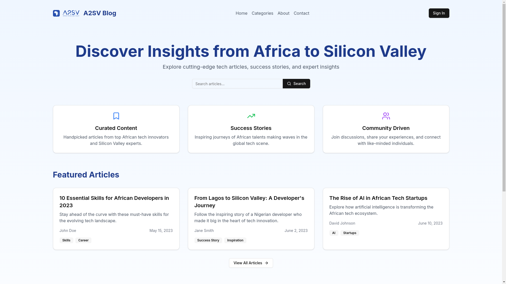
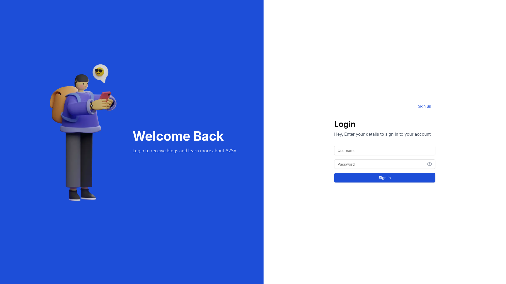
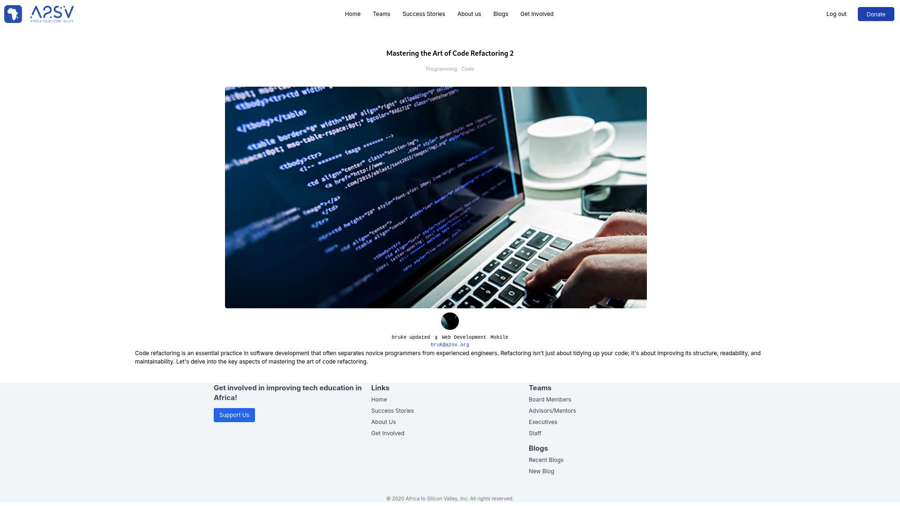
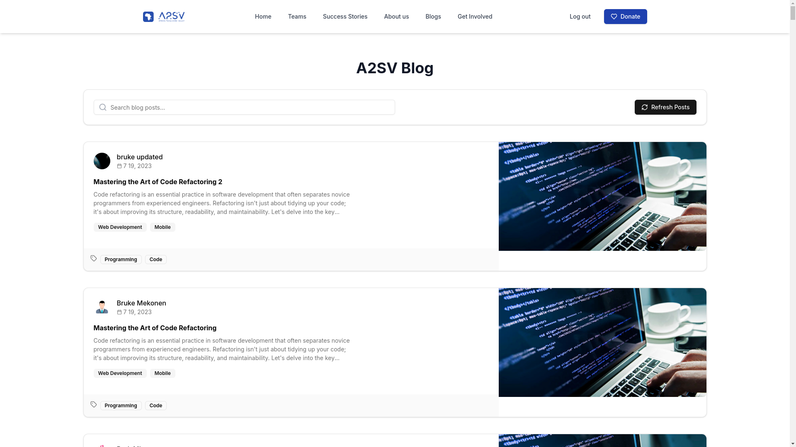
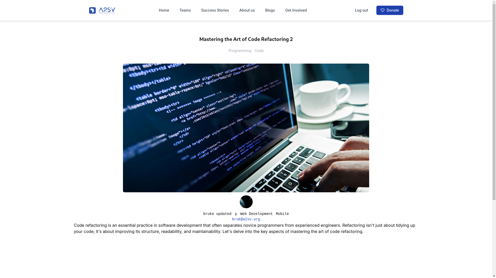

Here's an enhanced version of your README file with emojis and a more appealing structure:

---

# ✨ Blog Project

## 📖 Description
A dynamic blog project built with **Next.js**, featuring a list of blog posts and individual post pages. It's designed to be fast, responsive, and easy to use!

## 🚀 Getting Started

### ✅ Prerequisites
Before you begin, make sure you have the following installed:
- **Node.js** and **npm** installed on your machine 🖥️
- A code editor or IDE of your choice 📝

### ⚙️ Installation
1. **Clone the repository** to your local machine using:
   ```bash
   git clone https://github.com/BEKI77/blog-up.git
   ```
2. **Navigate** to the project directory:
   ```bash
   cd blog-project
   ```
3. **Install dependencies** by running:
   ```bash
   npm install
   ```

### ▶️ Running the Project
1. **Start the development server** by running:
   ```bash
   npm run dev
   ```
2. **Open your web browser** and navigate to:
   ```
   http://localhost:3000
   ```
   to view the blog 🎉

## 🌟 Features
- 📝 **List of blog posts** with titles, authors, and dates
- 📄 **Individual post pages** with full post content
- ⏳ **Loading state indicator** for when data is being fetched
- 📱 **Responsive design** for different screen sizes

## 🤝 Contributing
1. **Fork** the repository and **create a new branch** for your changes 🌿
2. **Make your changes** and **commit** them with a descriptive commit message ✍️
3. **Open a pull request** to submit your changes for review 🔍

*Note: This is just a starting point. Feel free to add more details or sections to your README file as needed.*

## 🖼️ Screenshots








